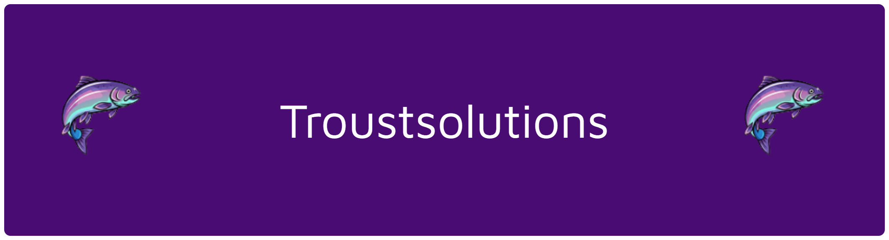

<p align="center">
  
  
  
  
</p>

<p align="center">
  
  
  
</p>

---

## 📝 Descrição do Projeto
O **TroustSolutions** é um ecossistema completo de monitoramento térmico para tanques de piscicultura (trutas). O sistema resolve um desafio crítico na criação de peixes: a manutenção da temperatura entre **10°C e 17°C**, enviando alertas em tempo real e automatizando a coleta de dados para garantir a saúde da produção.

## 🚀 Novas Funcionalidades e Melhorias
- 🔒 **Segurança:** Implementação de variáveis de ambiente (`.env`) para proteção de credenciais.
- 📉 **Dashboard Inteligente:** Gráficos de linha (Chart.js) com atualização em tempo real e reset automático de memória ao trocar de tanque.
- ⚡ **Automação de Banco de Dados:** - `Triggers` para validação de status de sensores.
    - `Stored Procedures` para geração de relatórios de saúde e devedores.
    - `Events` para limpeza automática de dados temporários.
- 📱 **Interface Responsiva:** KPIs de Mínima, Máxima e Média com indicadores visuais de **ALERTA/NORMAL**.

## 🛠️ Stack Técnica
- **Hardware:** 📟 Arduino + Sensor DS18B20.
- **Backend:** 🟢 Node.js / Express (API REST).
- **Banco de Dados:** 🔵 MySQL (Relacional).
- **Frontend:** 🎨 HTML5, CSS3 e JavaScript Moderno.

## 📁 Estrutura do Repositório
```text
├── Projeto/
│   ├── API/            # Backend Node.js e Segurança
│   ├── BD/             # Scripts SQL (Procedures, Triggers, Events)
│   ├── Arduino/        # Firmware do Sensor
│   └── Sites/          # Frontend e Dashboards
└── index.html          # Redirecionador para GitHub Pages
```
### Visualização Inicial: https://joaopassis06.github.io/TroustSolutions/Projeto/Sites/index.html
